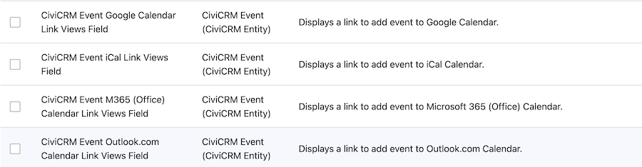

# CiviCRM Entity Calendar Links

This module provides calendar link view fields for CiviCRM entities.

## Features

- Generate calendar links for CiviCRM events.
- Supports iCal, Google Calendar, Microsoft 365 and Office.com formats.

## Installation

1. Download and place the module in the `modules/custom` directory.
2. Enable the module using the Drupal admin interface or Drush:
  ```sh
  drush en civicrm_entity_calendar_links
  ```

## Usage

- After enabling the module, calendar links will be available as fields in views which use the CiviCRM Event entity.



## Requirements

- Drupal 10 or higher
- CiviCRM 5.x or higher

## Maintainers

- [Nick Perkins](https://github.com/nickperkins)

## Contributing

Contributions are welcome! Please submit issues and pull requests to the [GitHub repository](https://github.com/nickperkins/civicrm_entity_calendar_links).

## Support

For support, please create an issue in the [GitHub repository](https://github.com/nickperkins/civicrm_entity_calendar_links/issues).
